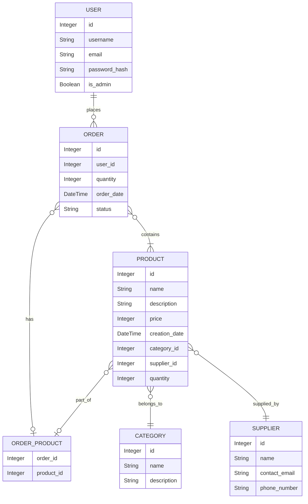

```mermaid 
erDiagram
    USER ||--o{ ORDER : places
    USER {
        Integer id
        String username
        String email
        String password_hash
        Boolean is_admin
    }

    ORDER }o--o| ORDER_PRODUCT : has
    ORDER }o--|{ PRODUCT : contains
    ORDER {
        Integer id
        Integer user_id
        Integer quantity
        DateTime order_date
        String status
    }

    PRODUCT }o--|| CATEGORY : belongs_to
    PRODUCT }o--|| SUPPLIER : supplied_by
    PRODUCT }o--o| ORDER_PRODUCT : part_of
    PRODUCT {
        Integer id
        String name
        String description
        Integer price
        DateTime creation_date
        Integer category_id
        Integer supplier_id
        Integer quantity
    }

    CATEGORY {
        Integer id
        String name
        String description
    }

    SUPPLIER {
        Integer id
        String name
        String contact_email
        String phone_number
    }

    ORDER_PRODUCT {
        Integer order_id
        Integer product_id
    }

```
